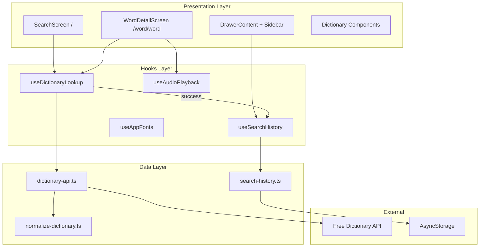
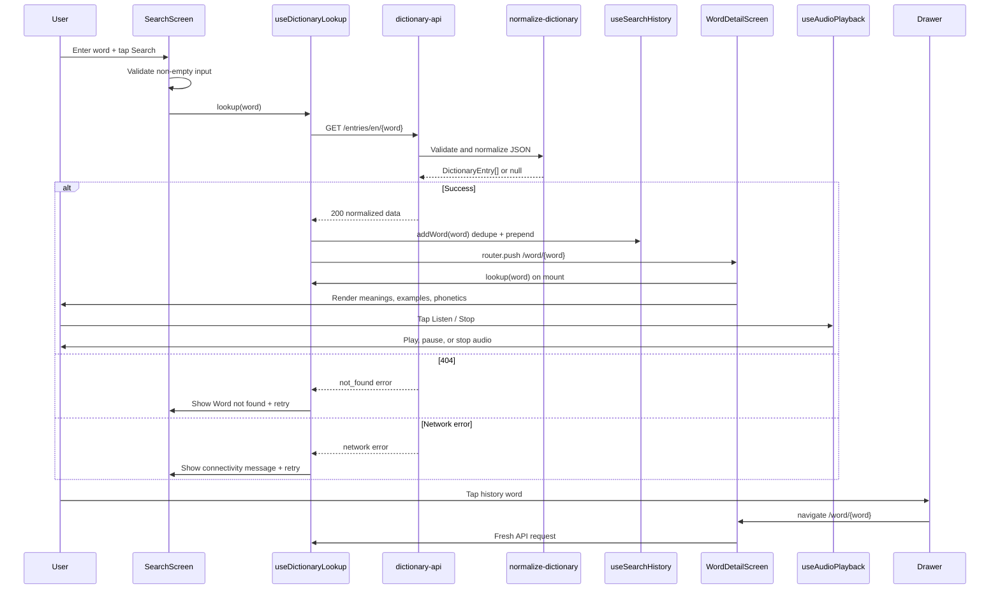

# LexiTech Dictionary — Design Document

**Client:** LexiTech Solutions Ltd, Kigali City  
**Platform:** React Native (Expo SDK 56) — Android, iOS, Web  
**API:** [Free Dictionary API](https://api.dictionaryapi.dev/api/v2/entries/en/)

---

## 1. Architecture

| Layer | Responsibility |
|-------|----------------|
| **Presentation** | Screens and UI components; no direct axios calls |
| **Hooks** | Loading/error/data state, audio lifecycle, font loading |
| **Data** | axios client, response normalization, AsyncStorage persistence |

---

## 2. Data Flow

---

## 3. Domain Entities

Defined in [`src/types/dictionary.ts`](../src/types/dictionary.ts):

| Entity | Fields |
|--------|--------|
| `DictionaryEntry` | `word`, `phonetics[]`, `meanings[]`, `license?`, `sourceUrls?` |
| `Phonetic` | `text?`, `audio?` |
| `Meaning` | `partOfSpeech`, `definitions[]`, `synonyms[]`, `antonyms[]` |
| `Definition` | `definition`, `example?`, `synonyms[]`, `antonyms[]` |
| `SearchHistoryItem` | `word`, `searchedAt` |
| `LookupError` | `kind`, `message`, `word` |

Normalization in [`src/utils/normalize-dictionary.ts`](../src/utils/normalize-dictionary.ts) ensures malformed API payloads do not crash the app.

---

## 4. Pages & Routes

| Route | Screen | Purpose |
|-------|--------|---------|
| `/` | Search | Text input, validation, search button, recent searches |
| `/word/[word]` | Word detail | Definitions, POS, examples, pronunciation |
| `/(settings)/settings` | Settings | App settings (template) |

**Navigation:** Drawer (Android) / Sidebar (web) with Home, Settings, and Search History.

---

## 5. Activity Compliance

| Activity | Implementation |
|----------|----------------|
| **1 — Search & API** | [`src/app/index.tsx`](../src/app/index.tsx), [`src/services/dictionary-api.ts`](../src/services/dictionary-api.ts) via axios |
| **2 — Word details** | [`src/app/word/[word].tsx`](../src/app/word/[word].tsx), dictionary components |
| **3 — Audio** | [`src/hooks/use-audio-playback.ts`](../src/hooks/use-audio-playback.ts), [`pronunciation-button.tsx`](../src/components/dictionary/pronunciation-button.tsx) — play, pause, stop |
| **4 — Drawer & history** | [`drawer-content.tsx`](../src/components/drawer-content.tsx), [`search-history.ts`](../src/services/search-history.ts) |
| **5 — Error handling** | [`lookup-error-state.tsx`](../src/components/dictionary/lookup-error-state.tsx), API error mapping, retry, normalization |

---

## 6. Tech Stack

| Tool | Use |
|------|-----|
| React Native + Expo SDK 56 | Cross-platform mobile framework |
| Expo Router | File-based navigation |
| axios | HTTP client for Free Dictionary API |
| expo-audio | Pronunciation playback |
| AsyncStorage | Persisted search history |
| Uniwind + Tailwind v4 | Styling with design tokens |
| Lucide | Icons |
| Inter (`@expo-google-fonts/inter`) | Typography |

**Testing:** `npx expo start` (Expo CLI via package.json)

---

## 7. Design System — Blue & White

**Rationale:** Blue conveys trust and clarity (library/reference apps). White backgrounds maximize readability for long definitions.

| Token | Light | Use |
|-------|-------|-----|
| `background` | Pure white | Page canvas |
| `primary` | LexiTech blue (~#2563EB) | Buttons, badges, accents |
| `primary-muted` | Light blue wash | Chips, hero backgrounds |
| `primary-foreground` | White | Text on blue surfaces |
| `foreground` | Deep navy | Headings and body text |
| `card` | White | Elevated cards with subtle shadow |

**Typography:** Inter — excellent legibility at small sizes, professional mobile app standard.

**Icons:** Lucide outline, strokeWidth 2, semantic mapping in [`dictionary-icons.ts`](../src/components/dictionary/dictionary-icons.ts).

---

## 8. Verification Checklist

1. Empty search → validation message
2. Valid word → loading → detail with POS, definitions, examples
3. Invalid word → "Word not found" + retry
4. Offline → network error + retry
5. Pronunciation → play, pause, stop; alert on failure
6. Multiple searches → drawer history, no duplicates
7. Tap history → fresh API fetch on detail screen
8. Visual → blue buttons, white cards, Inter font
